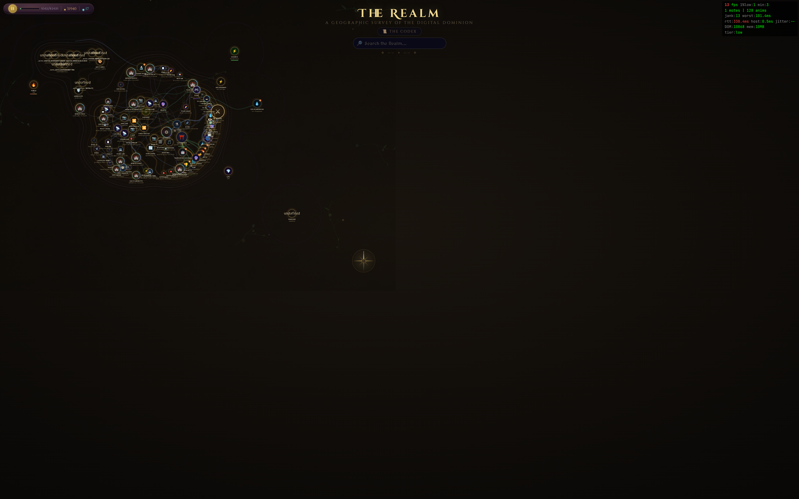
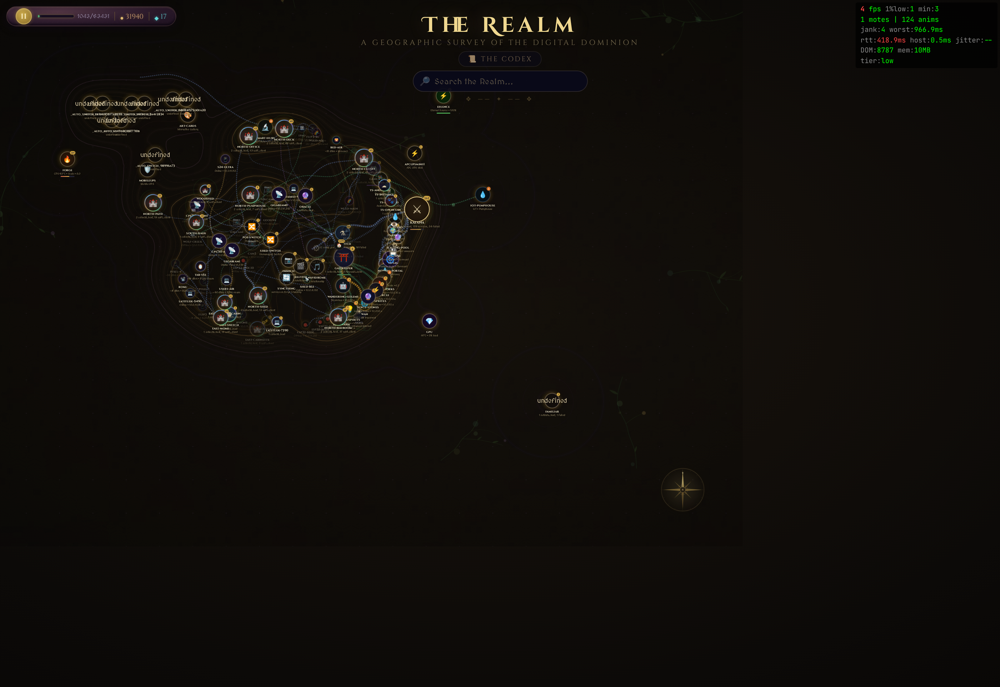
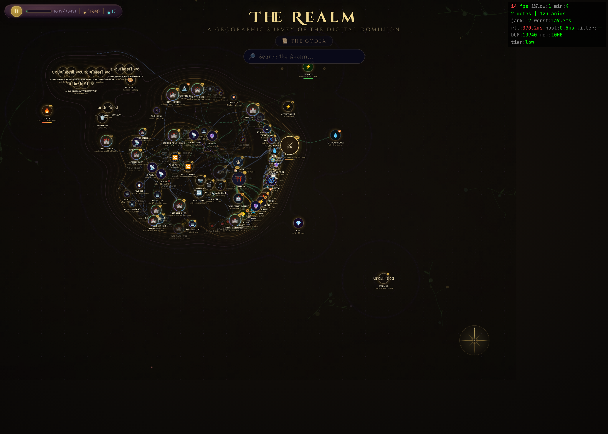
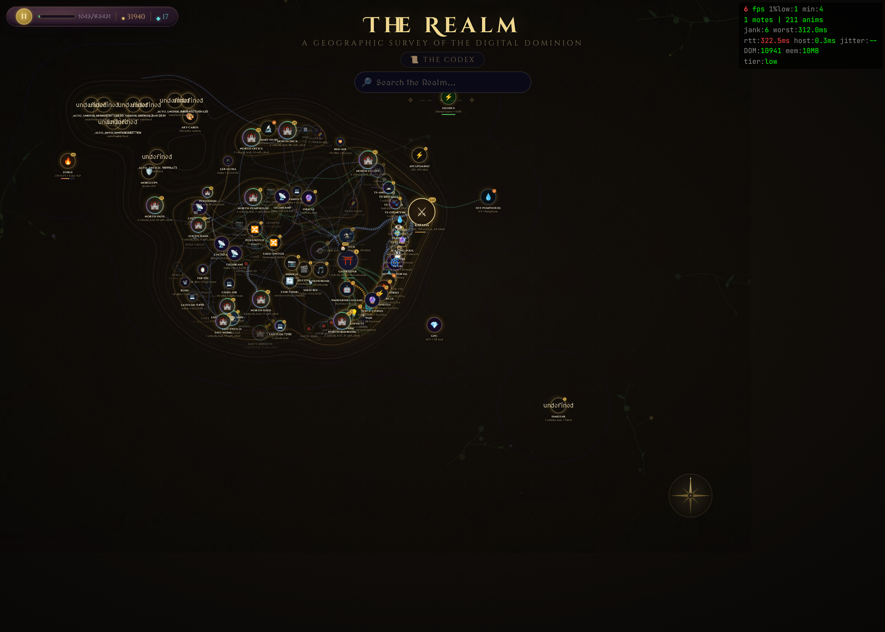

<div align="center">

# Realmwatch

**A fantasy-themed homelab network monitor that turns your infrastructure into a hand-painted realm map.**

*Every host is a node on the SVG canvas with a fantasy name, a persona, and a voice.
12 VLANs, 130+ nodes, 37 plugins, one unified CLI, an AI oracle, a herald daemon,
and a Zabbix-class alerting pipeline — all running from a single Linux box.*

[Quick start](#quick-start) · [Architecture](#architecture) · [Plugins](#plugin-catalog)
· [CLI](#the-realm-cli) · [Configuration](#configuration) · [Contributing](CONTRIBUTING.md)
· [Changelog](CHANGELOG.md)

</div>

---

Realmwatch is a hands-on, plugin-driven monitor for homelabs. It speaks fluent
collectd, Netdata, SNMP, nftables, Home Assistant, fwupd, fping, Docker, KVM,
LLDP, Tailscale, and Notion — but where most monitors render that into spark
lines, realmwatch renders it into a treasure map. A failing UPS becomes a Ward
losing its sigil. A roaming phone becomes a familiar slipping between towers. A
firewall counter becomes a dragon at the gate. Underneath the theming sits a
serious operational toolkit: live SVG topology, server-sent events, role-based
auto-discovery, trigger-dependency alert suppression, event acknowledgement,
and a unified `realm` CLI that exposes every capability via a single, ergonomic,
git-style command.

It is opinionated and personal — built around one user's homelab — but the
architecture is deliberately decoupled. The 37 plugins under `plugins/` each
live in their own directory with a `plugin.json` manifest, register themselves
with the server through a `setup(ctx)` hook, and can ship HTTP endpoints, SSE
sources, frontend panels, discovery providers, and CLI verbs. The core is a
rendering engine. Everything interesting is a plugin.

---

## Screenshots

Captured by `make screenshots` (Playwright against a running
`map_server.py` — see [`docs/screenshots/README.md`](docs/screenshots/README.md)
for prereqs).

<table>
<tr>
<td></td>
<td></td>
</tr>
<tr>
<td></td>
<td></td>
</tr>
</table>

> The map auto-arranges via a force-directed worker on first load; biome
> regions and contours are stamped by a separate heightmap worker. Both
> are pure ES module workers — no bundler magic.

---

## What you get out of the box

- **Interactive SVG realm map.** Pan/zoom canvas with ~130 nodes across 12+
  VLANs, animated traffic ley lines, terrain contours, biome regions, and
  drag-to-arrange layout. Web workers handle force-directed layout and
  heightmap stamping; pre-computed sublabels stream over SSE.
- **37 plugins.** Every domain feature — census, latency, firewall, WiFi
  scan, system updates, herald, chat, debug, discovery, alerting,
  maintenance windows, agent registration, discovery actions — lives as
  a plugin under `plugins/<name>/`. Drop-in. No registry.
- **Unified `realm` CLI.** Git-style dispatcher that resolves `realm <verb>`
  against `scripts/cli/`, `plugins/<name>/cli`, and `$PATH`. 36+ subcommands
  today, including a generic Method-B handler that reads `cli.verbs` from any
  plugin's `plugin.json`. Bash + zsh completion. `make cli-install` to
  symlink into `~/.local/bin/`.
- **Auto-OS discovery and Netdata fleet rollout.** `realm discover-os`
  concurrently SSHes every reachable host, captures `/etc/os-release`, and
  writes `os` / `os_version` / `tags` back to topology.
  `realm netdata-install` runs the official kickstart playbook against every
  Ubuntu host. `realm ansible-update` runs apt + DKMS + fwupd safely across
  the fleet.
- **Trigger-dependency alert suppression.** Zabbix-style. When a node's
  upstream gateway is already in a problem state, child-node alerts are
  suppressed at dispatch time. Eliminates the classic alert storm. Full
  audit trail in the alerting plugin.
- **Event acknowledgement workflow.** `realm event ack <id>` /
  `realm event close <id>` / `realm event comment`. Subsequent matching
  alerts are dropped while a human owns the problem.
- **Role templates.** 30+ typed node roles (gateway, router, switch, ap,
  server, nas, vm, hypervisor, desktop, …), each with default discovery
  providers, default sublabel format, and default tag set. New nodes get
  the right discovery treatment automatically.
- **AI oracle (Azure o4-mini).** Polls the events table for `oracle_query`
  events, calls Azure AI, posts responses back as realm events. Optional
  Azure TTS for voice. Sister daemon (`realm_herald.py`) narrates
  interesting nodes with themed personas.
- **Home Assistant + collectd + SNMP + nftables + WLED + fwupd + Docker +
  KVM + Notion.** Every bridge is a plugin. Each is replaceable.
- **No build dependencies beyond Python 3.12 and Node for esbuild.** No
  framework. No bundler config to learn. SQLite for state. stdlib
  `http.server` with ThreadingMixIn. SSE for live updates.

---

## Quick start

```bash
git clone https://github.com/jphein/realmwatch.git
cd realmwatch

make install      # pip install -r requirements.txt && npm install
make build        # esbuild src/main.js → realm-map.js (minified IIFE)

# Bootstrap your local-only inventory (gitignored — never committed)
cp scripts/lib/fleet.sh.example scripts/lib/fleet.sh
$EDITOR scripts/lib/fleet.sh    # plug in your APs / routers / switches
cp realm-local.json.example realm-local.json
$EDITOR realm-local.json        # per-node herald templates + future hooks

make dev          # python3 map_server.py — foreground HTTP :80 + SSE + plugins

# In another shell — install the CLI into ~/.local/bin
make cli-install  # symlinks realm + every realm-* subcommand, no sudo

# Sanity check
make cli-doctor   # verifies PATH, completion, jq/curl/column, server reach
realm             # prints the command index
realm status      # GET /status — colored table view
realm watch       # tail SSE events live
```

### Your private data stays local

A few files are intentionally **gitignored** so each operator's realm-specific
data never enters the public repo:

| File | What you put in it |
|------|-------------------|
| `realm-local.json` | Per-node herald persona templates (loaded by `realm_herald.py` at import) |
| `scripts/lib/fleet.sh` | Your APs / routers / switches inventory (sourced by `realm fleet …` and the `ap-*.sh` scripts) |
| `personas.json` | Initial seed for the personas table — voices + system prompts (optional; UI can populate at runtime) |
| `wifi-guide.html`, `report-card.html` | Family-facing pages served by realm-portal at LAN |
| `.env` | API tokens (Azure AI, Notion, HA, Cloudflare, etc.) and any host-specific config |

Bootstrap from the `.example` versions; the engine reads them lazily with
empty defaults if missing. See `realm-local.json.example` and
`scripts/lib/fleet.sh.example` for the schemas.

Open `http://localhost/realm-map.html` — panels render from the bundled core,
plugin panels load at runtime from `/plugins/<name>/panel.{html,js,css}`, SSE
streams `status / traffic / topology / energy / latency / firewall / wifi /
plugin-broadcast / realm-event` events. No hot reload — plugin changes need a
server restart.

> **Port 80** — `map_server.py` binds to `:80` by default. On Linux this
> needs `CAP_NET_BIND_SERVICE` on the Python interpreter (one-time, via
> `scripts/enable-port80.sh`) or you can run on a different port with
> `REALM_PORT=8080 make dev`.

### Optional daemons

All daemons are **off by default**. Opt in per-service:

```bash
make oracle       # python3 oracle_daemon.py --no-voice
make herald       # python3 realm_herald.py
```

For unattended operation, copy the systemd units:

```bash
cp systemd/*.service ~/.config/systemd/user/
systemctl --user daemon-reload
systemctl --user enable --now realm-map-server   # opt in per-unit
```

Five user units ship in `systemd/`: `realm-map-server`, `oracle-daemon`,
`realm-herald`, `realm-launcher`, `realm-theme-watcher`.

### Daily update orchestration (optional)

```bash
make update-all-install     # ~03:00 daily timer, no sudo
make update-all-uninstall   # remove
```

Runs `realm update-all` — two-stage: katana host via the system-updates plugin,
then every Ubuntu host in the realm via Ansible. DKMS state verified after
apt upgrade. fwupd metadata synced. Reboot-required flags surfaced.

---

## Architecture

```
┌────────────────────────────────────────────────────────────────────────┐
│ Browser — realm-map.html (SVG canvas, dockable panels, SSE consumer)   │
│   src/*.js → esbuild IIFE bundle → realm-map.js                        │
│   plugins/<name>/panel.{js,html,css} loaded at runtime, no bundling    │
└────────────────────────────────────────────────────────────────────────┘
                                 │ HTTP + SSE
                                 ▼
┌────────────────────────────────────────────────────────────────────────┐
│ map_server.py :80   (stdlib http.server + ThreadingMixIn)              │
│   ├── Static:  / (splash)  /realm-map.html  /codex/  /plugins/<…>      │
│   ├── API:     /status /topology /personas /settings /events /node …   │
│   ├── SSE:     /sse  (status, traffic, energy, latency, firewall,      │
│   │                   wifi, topology, plugin-broadcast, realm-event)   │
│   ├── Core:    engine.py · realm_db.py · sse_broker.py                 │
│   │            discovery_engine.py · route_table.py · node_roles.py    │
│   └── Plugins: plugin_loader.py · plugin_registry.py · plugin_context  │
│                ↓  scans plugins/, validates manifests                  │
│                ↓  topological sort on depends_on                       │
│                ↓  setup(ctx) for every integrated plugin               │
│                ↓  hooks: endpoints / SSE sources / enrichers /         │
│                          discovery providers / background threads     │
└────────────────────────────────────────────────────────────────────────┘
                 │                                  │
                 ▼                                  ▼
   Independent daemons                  Discovery providers
   (separate processes)                  (per-host, pluggable)
   ─────────────────────                 ────────────────────
   oracle_daemon.py                      netdata · snmp · docker
   realm_herald.py                       kvm · systemd · nmap
   realm_launcher.py :8899               ha · caddy · github · …
```

**Two design rules carry most of the weight:**

1. **Thin core, fat plugins.** The bundled frontend is a rendering engine —
   panel system, SVG canvas, terrain compositor, traffic animator, SSE
   dispatch. Every domain panel is a plugin that registers itself at server
   start. New features should be plugins. The core grows only for rendering
   or infrastructure changes.

2. **`engine.py` is the single source of truth.** All realm logic — sensor
   readings, Tailscale mesh, nft counters, fantasy translations — lives
   in `engine.py`. Other files may call into it; never duplicate it.

Deeper architecture writeup: [`docs/`](docs/) (browseable as GitHub Pages
once enabled in repo settings).

---

## Plugin catalog

37 plugins across UI, data bridges, discovery, infrastructure, and effects.

### UI panels

| Plugin | Fantasy name | Icon | Role |
|---|---|---|---|
| `census` | Realm Census | ⚑ | Grouped node list with live online/offline status from SSE |
| `chat` | Oracle Link | 💬 | Session-based Azure AI chat, context-aware node discussions (o4-mini) |
| `codex` | Lore Archives | 📚 | Notion-synced lore wiki served at `/codex/` |
| `debug` | Arcane Mirror | 🔮 | Debug panel, API catalogue, Scrying Terminal command interface |
| `lexicon` | The Naming Ledger | 📜 | Stable per-node identity. `fleet.yaml` owns `current_name`, `prior_names`, `kind`, `role`, `realm`. `/fleet/rename`, `/fleet/replace`, `/fleet/promote`, `/fleet/reload`. mtime hot-reload. Discovery emits tentative entries |
| `plugin-manager` | Enchantment Registry | 📜 | Lists loaded plugins, endpoints, SSE sources, panels |
| `scan` | Survey Glass | 🔭 | On-demand WiFi/LLDP/firewall/oracle/discovery triggers |
| `skills` | Inscription Codex | ✎ | Browse and edit Skills, CLAUDE.md, Hooks, Agents |
| `system-updates` | Scroll of Patch Runes | 📜 | APT, Snap, Flatpak, mise, brew, npm, pip, firmware, AI CLIs |
| `projects` | The Scholar's Archive | 📚 | Local `~/Projects/` inventory, git status, stack detection |

### Data bridges

| Plugin | Fantasy name | Icon | Role |
|---|---|---|---|
| `collectd` | Scrying Stones | 📊 | Collectd RRD reader + live UDP listener + Realm Census panel |
| `firewall` | Ward Stones | 🛡️ | nftables JSON parser — zones, VLAN mapping, suggestions, counters |
| `ha` | Crystal Bridge | 🏠 | Home Assistant REST poll — entity states, device enrichment, energy |
| `latency` | Arcane Pulse | 🏸 | fping batch prober for wired nodes (30s), RTT grouped by VLAN |
| `wifi` | Aether Towers | 📡 | SSH to APs — iwinfo clients, DHCP identity, LLDP topology |
| `wled` | Prismatic Lights | 💡 | WLED HTTP polling + control |
| `notion` | Quest Portals | 📜 | Today todos → quests; archive completed; codex sync |
| `netdata` | Oracle Sight | 🕮 | Netdata agent REST — info, charts, alarms, collectors |
| `caddy` | Gate Warden | 🚧 | Reverse proxy discovery — Caddyfile / admin API |
| `health` | Watchtower Beacon | 🚨 | HTTP/TCP/TLS expiry + realm-sigil version probes |
| `alerting` | Herald's Watch | 📢 | Routes realm events to channels; trigger-dependency suppression |

### Discovery providers

Feed the discovery engine. Each emits sub-entities that link back to topology
nodes through `discovery_links`.

| Plugin | Scans |
|---|---|
| `discovery` | Companion plugin — registers the engine's API, SSE source, enricher |
| `docker-discovery` | Containers on hosts via SSH |
| `kvm` | KVM/libvirt VMs on hypervisors via `virsh` |
| `systemd` | Interesting services via SSH or local D-Bus |
| `snmp` | Switch ports, interfaces, MAC tables; SNMPv2c + SNMPv3 (auth+priv) |
| `nmap` | Open ports, service versions, OS fingerprinting |
| `github` | Repos, CI status, PRs via `gh` CLI |
| `projects` | Local `~/Projects/` inventory, git status, stack detection |
| `manual` | Static infrastructure entries, relationships, tags, bookmarks |

### Infrastructure / operations

| Plugin | Fantasy name | Icon | Role |
|---|---|---|---|
| `maintenance` | Veiled Hours | 🔨 | Scheduled maintenance windows that suppress alerts and herald speech for planned downtime |
| `agent-register` | The Heralds' Gate | 🚪 | Active agent auto-registration — hosts self-announce + heartbeat; metadata feeds the discovery-actions pipeline |
| `discovery-actions` | The Onboarding Sigils | 🪄 | Declarative auto-classification: *if OUI matches OpenWrt then role=ap*. YAML rules evaluated at discovery time |

### Daemons / effects / services

| Plugin | Fantasy name | Icon | Role |
|---|---|---|---|
| `herald` | Town Crier | 📯 | Manages the realm-herald subprocess (themed node speech) |
| `events` | Sentinel Wards | ⚡ | Threshold monitor — collectd/HA → fantasy-themed alerts |
| `ansible` | War Room | ⚔️ | Ansible playbook execution + AI-assisted infrastructure ops |
| `forest-theme` | Enchanted Canopy | 🌿 | Ambient particles — wisps, butterflies, fireflies, leaves, fog |
| `game-servers` | Arena Watcher | 🎮 | Minecraft Bedrock UDP ping, Terraria TCP check |

---

## The `realm` CLI

A git-style dispatcher. Type `realm <verb>`. The dispatcher resolves the verb
in this order and execs the first match:

1. `scripts/cli/realm-<verb>` — core hand-written subcommand.
2. `plugins/<verb>/cli` — Method-A plugin executable (any language).
3. `plugins/<verb>/plugin.json` with `cli.verbs` — Method-B declarative pass-through.
4. `realm-<verb>` anywhere on `$PATH` — third-party / personal extension.

No registry. Adding a new command means dropping a file. Bash + zsh completion
queries the live filesystem.

### Core subcommands

| Command | Summary |
|---|---|
| `realm status` | Show full realm system status |
| `realm watch [--filter TYPE]` | Tail realm events from `/sse` (live) |
| `realm topology` | Show network topology (nodes and connections) |
| `realm quest list\|create\|complete\|delete` | Quest CRUD |
| `realm persona list\|get\|set` | Node persona CRUD |
| `realm tags list\|get\|add\|remove` | Manage tags on topology nodes |
| `realm discovery list\|providers\|scan` | Discovery engine controls |
| `realm alerting status\|channels\|rules\|why` | Alerting + dependency explain |
| `realm event list\|post\|ack\|close\|comment` | Event log + ack workflow |
| `realm role list\|show\|nodes` | Browse role registry + templates |
| `realm macro set\|get\|delete\|list\|explain` | User macros for alerting rule values |
| `realm plugins list\|toggle` | Plugin management |
| `realm config get\|set` | Realm server-side config |
| `realm settings get\|set\|unset` | Per-plugin settings stored in `realm.db` |
| `realm ping <host>` | Ping a host through the realm server |
| `realm wol <node>` | Send Wake-on-LAN packet to a node |
| `realm ssh <node> <cmd>` | Run a command via the realm SSH endpoint |
| `realm resolve <url>` | Resolve a URL through the realm |
| `realm player` | Show player state or award rewards |
| `realm debug` | Dump tables, endpoints, plugin state |
| `realm health` | Local + sibling-service `/api/version` health |
| `realm api <method> <path> [body]` | Generic HTTP escape hatch |
| `realm fleet audit\|migrate-ssid\|add-vlan\|firewall-check` | OpenWrt fleet ops |
| `realm version [--all]` | CLI version + (with `--all`) sibling services |
| `realm completion bash\|zsh` | Emit shell completion script |

### Fleet + update orchestration

| Command | Summary |
|---|---|
| `realm discover-os` | Concurrent SSH probe — write OS info back to topology |
| `realm netdata-install` | Install Netdata agent on every Ubuntu host (idempotent) |
| `realm ansible-update` | Run apt+DKMS+fwupd playbook on every Ubuntu host |
| `realm update-all` | Two-stage: katana (system-updates) + Ubuntu fleet (ansible) |

### Plugins with declarative CLI verbs (Method B)

The dispatcher reads `cli.verbs` directly from `plugin.json` and pipes through
`scripts/lib/http.sh`. No per-plugin code required.

| Plugin | Verbs |
|---|---|
| `wifi` | `aps`, `clients`, `lldp`, `status`, `scan` |
| `ansible` | `inventory`, `playbooks`, `runs`, `run`, `run-check`, `ai` |
| `chat` | `ask`, `sessions`, `history`, `clear` |
| `collectd` | `show` |
| `latency` | `show` |
| `firewall` | `show` |
| `ha` | `energy` |
| `herald` | `status` |
| `notion` | `sync`, `complete` |
| `system-updates` | `list`, `inventory`, `history`, `check`, `check-one`, `run`, `run-one`, `cancel`, `approve`, `skip` |
| `maintenance` | `list`, `active`, `check`, `cancel` |
| `agent-register` | `list`, `show`, `install-script`, `forget` |
| `discovery-actions` | `list`, `test`, `apply`, `delete` |

### CLI conventions (clig.dev)

- **stdout = data**, **stderr = chatter**. Pipeable.
- **`--json` for machine output.** Default is human-friendly tables / kv.
- **`NO_COLOR`, `--no-color`, isatty detection** — color off when piped.
- **Exit codes**: 0 success, 1 general, 2 usage, 3 network, 4 config/auth,
  5 server-side, 127 unknown subcommand.
- **Common flags** (handled centrally in `scripts/lib/args.sh`): `-h`,
  `--help`, `--version`, `-v`/`--verbose`, `-q`/`--quiet`, `--no-color`,
  `--json`, `--dry-run`, `--host URL`.

Full design spec: [`docs/superpowers/specs/2026-05-16-realm-cli-first-rate-design.md`](docs/superpowers/specs/2026-05-16-realm-cli-first-rate-design.md).

---

## Configuration

### Environment variables

Copy `.env.example` → `.env`. `map_server.py` auto-loads it on startup.

| Variable | Required for | Default |
|---|---|---|
| `HA_TOKEN` | Home Assistant bridge | — |
| `HA_URL` | — | `https://10.0.6.108:8123` |
| `NOTION_TOKEN` | Quest + codex sync | — |
| `NOTION_DATABASE_ID` | Quest sync | — |
| `AZURE_AI_API_KEY` | Chat + oracle | — |
| `AZURE_AI_ENDPOINT` | Chat + oracle | — |
| `AZURE_SPEECH_KEY` / `_REGION` | Oracle TTS | — |
| `REALM_PORT` | — | `80` |
| `REALM_DOMAIN` | — | — |
| `KATANA_IP` / `ROUTER_IP` / `UBOX_IP` | Override built-in defaults | per `engine.py` |
| `SWITCH_*_SNMP_AUTH` / `_PRIV` | SNMPv3 discovery | — |

### XDG directories (CLI)

The `realm` CLI follows XDG:

- Config: `$XDG_CONFIG_HOME/realm/` → `~/.config/realm/`
- State: `$XDG_STATE_HOME/realm/` → `~/.local/state/realm/`
- Cache: `$XDG_CACHE_HOME/realm/` → `~/.cache/realm/`

Optional `~/.config/realm/config.sh` can set `REALM_HOST`, `REALM_PORT`, etc.
A project-local `.realm.conf` overrides per-directory.

### Secrets

This repo never commits secrets. Recommended pattern: keep them in a password
vault (the author uses [Vaultwarden](https://github.com/dani-garcia/vaultwarden)
via the `bw` CLI) and populate `.env` from there:

```bash
bw get password "Home Assistant LLT" > /dev/null  # primes the session
echo "HA_TOKEN=$(bw get password 'Home Assistant LLT')" >> .env
echo "NOTION_TOKEN=$(bw get item Notion | jq -r '.fields[] | select(.name=="api_token") | .value')" >> .env
```

`.env` and `.mcp.json` are in `.gitignore`. SNMPv3 passwords are read from
named env vars referenced from the per-node discovery config — never stored in
`realm.db` or `topology.json`.

---

## Database (`realm.db`, SQLite WAL)

12 tables; live data; never drop or truncate.

| Table | Purpose |
|---|---|
| `settings` | Key-value per namespace |
| `events` | Timestamped realm events (plus ack/close columns since v0.4) |
| `personas` | Per-node persona data |
| `nodes` | Topology nodes with positions, `os`, `os_version`, `tags` |
| `connections` | Node-to-node connections |
| `regions` | Biome map regions |
| `quests` | Quest log |
| `notion_synced` | Notion sync state |
| `wifi_scans` | WiFi scan history |
| `sub_entities` | Discovery-engine sub-entities |
| `discovery_links` | Edges between sub-entities and topology nodes |
| `discovery_capabilities` | Provider capability declarations |

`topology.json` is a downstream artifact regenerated from `nodes` /
`connections`. It is gitignored — query via the HTTP API
(`curl -s http://localhost/topology`), don't read it directly.

---

## SSE event stream (`/sse`)

| Event | Frequency | Content |
|---|---|---|
| `status` | 10s | Sensors, collectd, WiFi, HA, sublabels |
| `traffic` | 5s | Per-node traffic intensity (log scale) |
| `topology` | 60s | Full topology (nodes + connections + regions) |
| `energy` | 30s | Solar, battery, grid (HA) |
| `latency` | 30s | Pre-grouped latency by VLAN |
| `firewall` | 60s | Parsed nftables (cached) |
| `wifi` | 120s | AP client lists, signal data |
| `plugin-broadcast` | live | Plugin-dispatched events |
| `realm-event` | live | Individual realm events (speech, alert, highlight, quest) |

Initial burst on connect: `topology → traffic → energy → latency → recent
events → status`. The broker hash-dedupes — only pushes on change.

---

## Contributing

See [CONTRIBUTING.md](CONTRIBUTING.md) for the full guide. Quick version:

- **New plugin.** Make `plugins/<name>/plugin.json` + `plugin.py` with a
  `setup(ctx)` function. The `PluginContext` exposes endpoint registration,
  SSE source registration, node enricher hooks, discovery provider
  registration, shared DB access, and a per-plugin logger. Drop a
  `panel.html/js/css` to add a frontend panel. Restart `map_server.py` (no
  hot reload).
- **New CLI subcommand.** Method A — drop an executable at
  `plugins/<name>/cli` that responds to `--one-line-help` /
  `--list-subcommands` / `--help`. Method B — add a `cli.verbs` block to
  `plugin.json` and let the generic handler proxy HTTP for you.
- **PR flow.** Branch from `master`, run `make build` after touching
  `src/*.js`, run `make cli-doctor` if you touched the CLI, commit in
  conventional-commit style (`feat:`, `fix:`, `refactor:`, `docs:`, `chore:`),
  open a PR.
- **Issues.** [GitHub issues](https://github.com/jphein/realmwatch/issues).
  Labels: `enhancement`, `ux`, `zabbix-inspired`, `public-release`. Roadmap
  lives in the open issues — pick one and dig in.

---

## License

Realmwatch is licensed under the [GNU General Public License v3.0](LICENSE)
— a copyleft license that keeps forks open. Contributions are accepted under
the same terms. See [CODE_OF_CONDUCT.md](CODE_OF_CONDUCT.md) for community
expectations.

---

## Roadmap

Open issues tagged `zabbix-inspired` and `public-release` track the active
roadmap. Already shipped in v0.4.0: trigger dependencies, event
acknowledgement, role templates, user macros, `node.tags`, maintenance
windows, agent self-registration, discovery actions, and Low-Level
Discovery prototypes.

Still open:

- **Ubuntu major release upgrades via realm CLI** ([#11](https://github.com/jphein/realmwatch/issues/11))
- **Screenshots in README + landing page** ([#13](https://github.com/jphein/realmwatch/issues/13))

---

## Acknowledgements

Realmwatch sits on the shoulders of giants. None of these are vendored — the
repo just talks to them — but the project would be unrecognisable without:

[Netdata](https://github.com/netdata/netdata) ·
[collectd](https://www.collectd.org/) ·
[Home Assistant](https://www.home-assistant.io/) ·
[OpenWrt](https://openwrt.org/) ·
[esbuild](https://esbuild.github.io/) ·
[WinBox](https://github.com/nextapps-de/winbox) ·
[fping](https://fping.org/) ·
[nftables](https://www.nftables.org/) ·
[fwupd](https://fwupd.org/) ·
[Ansible](https://www.ansible.com/) ·
[Notion API](https://developers.notion.com/) ·
[Azure AI](https://azure.microsoft.com/en-us/products/ai-services).

And to [Zabbix](https://www.zabbix.com/) — half the roadmap is unashamedly
inspired by what they got right two decades ago.
