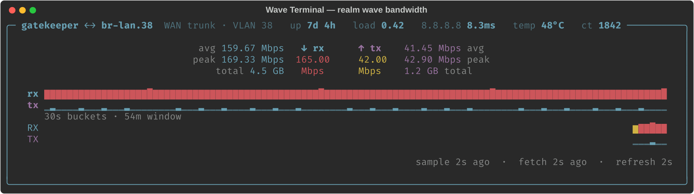
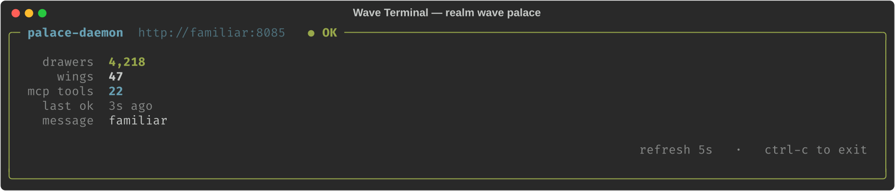
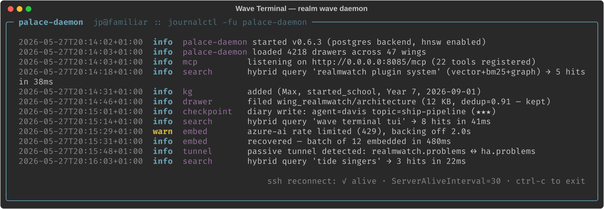
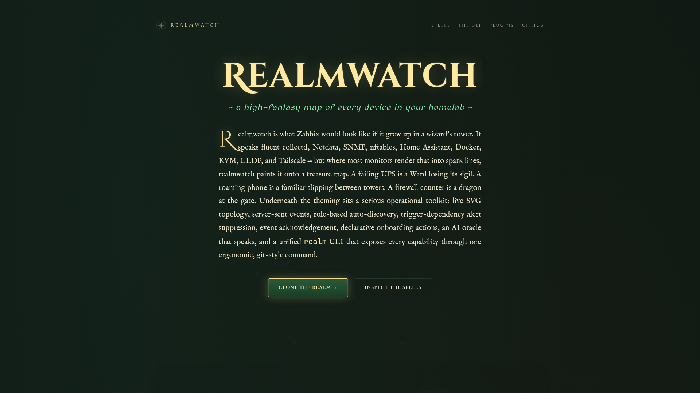
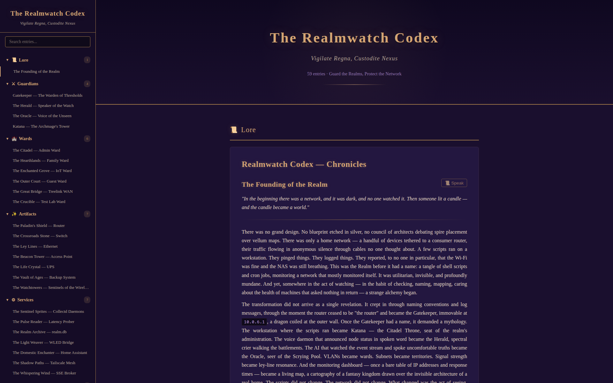

# Realmwatch Screenshots

Image assets for the project README and the GitHub Pages landing at
[realm.watch](https://realm.watch). See **[CAPTURE.md](CAPTURE.md)** for
the exact commands that produce each file — keep that in sync when you
add or rename images.

## Captured

### Wave Terminal TUIs

Rendered statically from each TUI's `render(...)` function via
`render-wave-tuis.py` (no live data needed):

| Preview | File | What it shows |
|---|---|---|
|  | `wave-bandwidth.{svg,png}` | `realm wave bandwidth` — live WAN trunk (gatekeeper br-lan.38) with 30s-bucket sparklines and per-direction stats |
|        | `wave-palace.{svg,png}`    | `realm wave palace` — palace-daemon health pill, drawer/wing/tool counts |
|        | `wave-daemon.{svg,png}`    | `realm wave daemon` — journal tail of palace-daemon with reconnect status footer |

SVG is the preferred embed for the GitHub Pages landing (scales
perfectly, ~5–50 KB). PNG is the README fallback since GitHub renders
inline `` but not `<svg>` from a README on github.com.

### Static site pages

Captured from the built `docs/` Jekyll site via headless Chrome on disk:

| Preview | File | What it shows |
|---|---|---|
|  | `landing-page.png` | `docs/index.html` hero at 1920×1080 (dark theme) |
|      | `codex-page.png`   | `docs/codex/index.html` chronicle index at 1920×1200 |

## Pending

These need a running `map_server` (port 80) and the existing
`scripts/capture-shots.py` (Playwright). Filenames are stable — the
README and landing page already reference them.

| File | What it will show |
|---|---|
| `01-realm-map-full.png` | Full realm map at zoom-out — the treasure-map view |
| `02-realm-map-zoom.png` | Mid-zoom showing nodes, regions, traffic ley lines |
| `03-node-panel.png`     | Node detail panel — stats, persona, controls |
| `04-scan-panel.png`     | Survey Glass scan panel mid-discovery |
| `05-system-updates.png` | Scroll of Patch Runes — pending updates per source |

Refresh recipe in **[CAPTURE.md](CAPTURE.md)**. TL;DR:

```bash
make dev &                                       # leave running
.venv/bin/pip install playwright && \
  .venv/bin/python3 -m playwright install chromium   # one-time
.venv/bin/python3 scripts/capture-shots.py
```

## Helpers in this directory

| File | Purpose |
|---|---|
| `render-wave-tuis.py` | Imports each Wave TUI's `render()` function with mocked state, exports SVG via `rich.Console.export_svg()`, rasterises to PNG via `inkscape`. |
| `CAPTURE.md` | Step-by-step capture recipe for every image above. |
